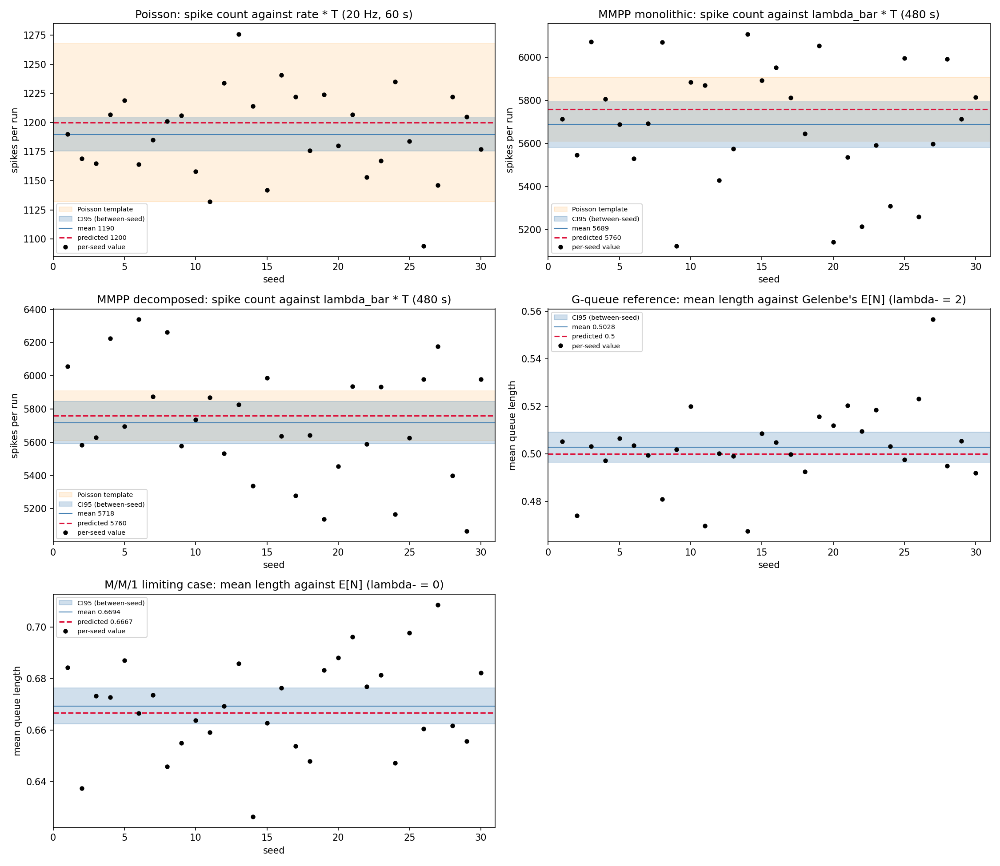
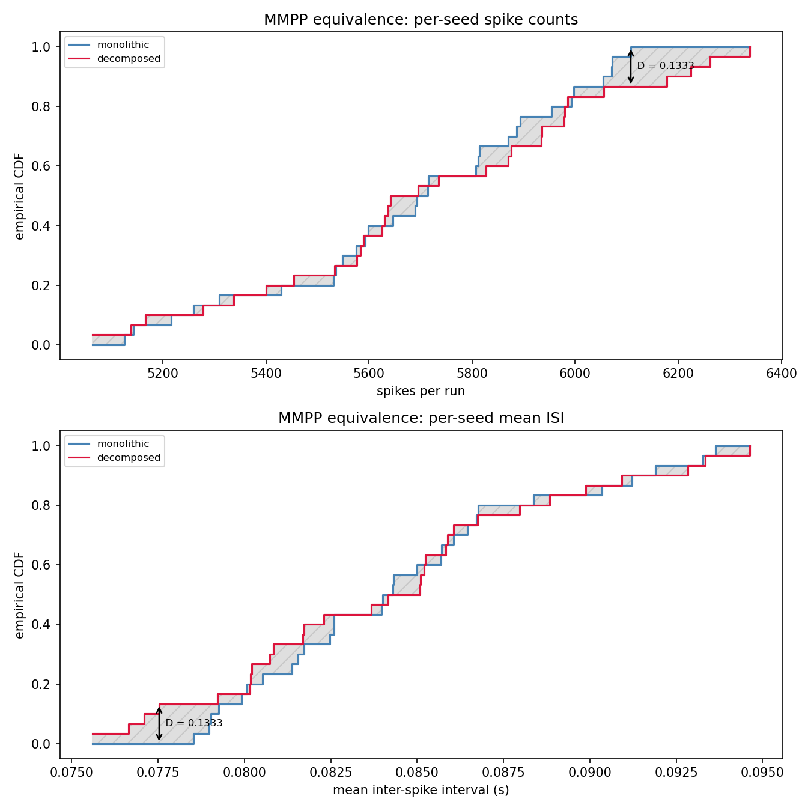
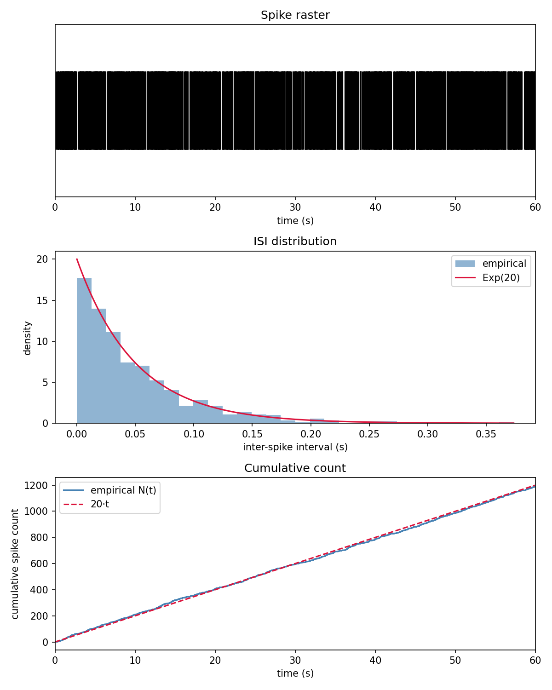
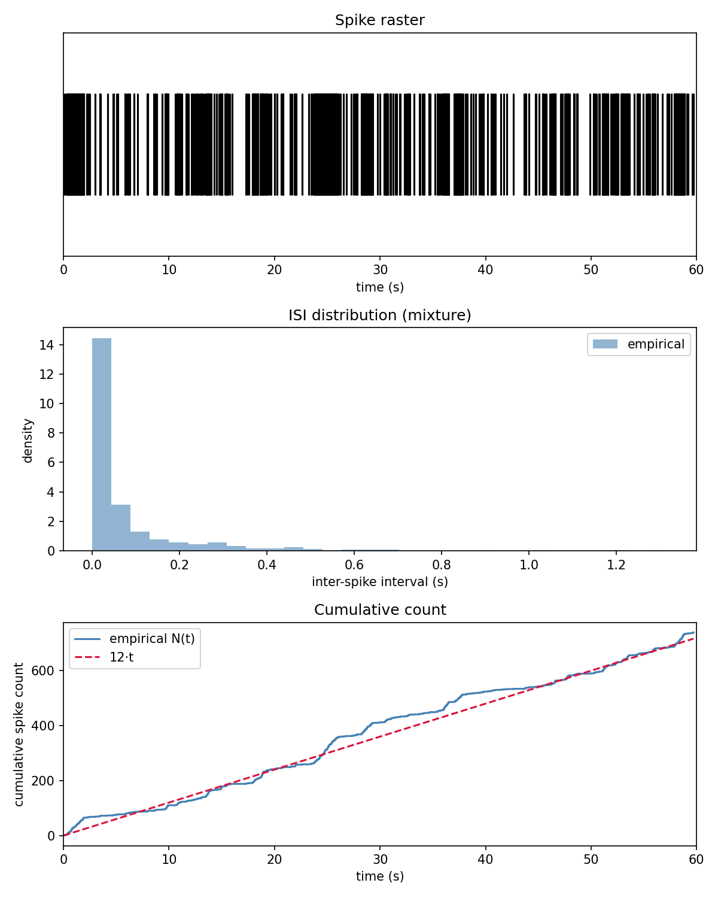
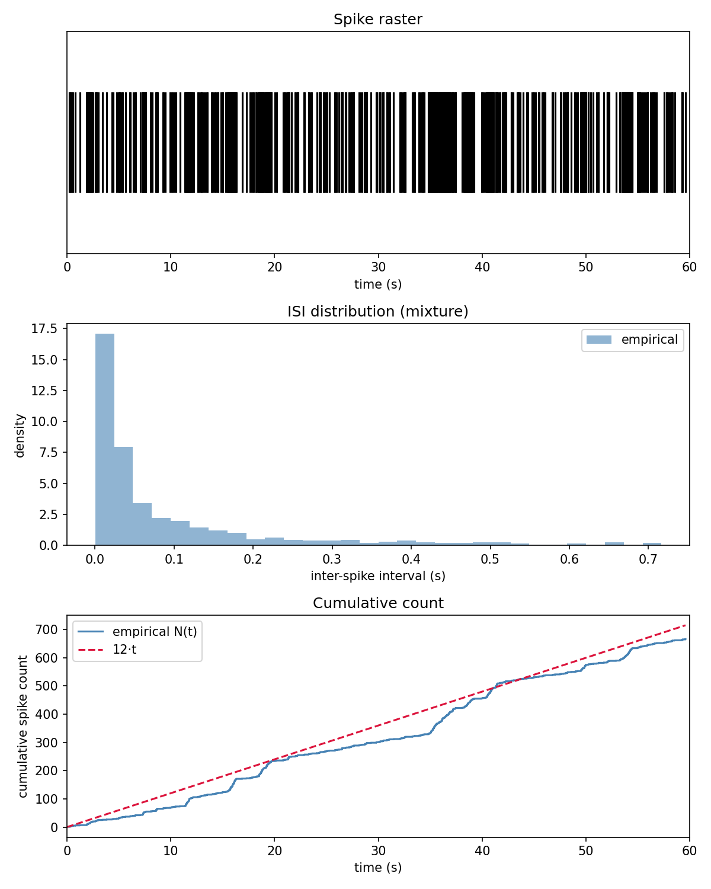
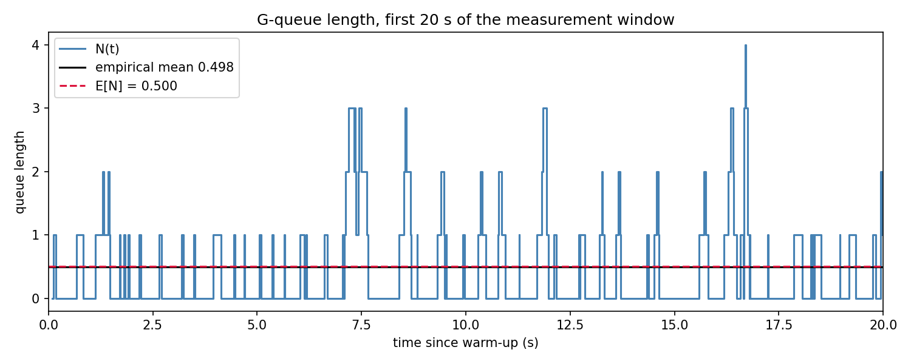

# Évaluation

*Dernière mise à jour : semaine 14 (août 2026).*

Cette page présente la stratégie de test, les résultats obtenus sur les trois familles de processus, leur interprétation et les limites actuelles.

## Méthodes de validation

La validation opère selon les trois critères de correction posés en hypothèse. Chacun a une nature propre, et le projet les garde volontairement séparés : les tests automatisés vérifient ce qui est déterministe, les campagnes valident ce qui est statistique, et le test d'équivalence tranche une question qu'aucun des deux ne pose.

### Critère 1 : les invariants

La suite pytest compte **187 tests**, dont la grande majorité ne lance aucune simulation.

Côté structure : le câblage des sous-modèles, les gardes de validité qui lèvent une exception (`rate > 0` pour le neurone de Poisson ; pour le MMPP et la chaîne de Markov, taux strictement positifs, $Q$ carrée et compatible avec `rates`, lignes de somme nulle, hors-diagonale non négative, taux de sortie strictement positif ; pour la file de Gelenbe, taux de service strictement positif et longueur initiale non négative ; pour son assemblage, $\lambda^-$ non négatif), le `timeAdvance` infini du Transducer, et l'enregistrement chronologique des couples `(temps, payload)` dans l'horizon de simulation.

Côté déterminisme : la reproductibilité par graine (deux modèles de même graine produisent exactement la même séquence de tirages), la pureté du `timeAdvance` et de l'`outputFnc`, l'order-independence de la dérivation des flux, et l'exactitude des fonctions de calcul (`compute_isi`, `theoretical_stats`, `confidence_interval`, `discard_warmup`, `time_average`, `time_weighted_histogram`, `gqueue_utilization`, `gqueue_mean_length`, `gqueue_length_distribution`).

Chaque famille ajoute les invariants propres à sa machine à états :

| Famille | Invariants spécifiques testés |
|---------|-------------------------------|
| **MMPP** | Résolution des deux horloges concurrentes (victoire du spike, victoire de la transition, priorité au spike en cas d'égalité) · décrément de l'horloge de transition plutôt que re-tirage quand un spike gagne · généricité du nombre d'états (une chaîne à trois états simule sans cas particulier) |
| **MarkovChain** | Le taux publié par `outputFnc` est exactement celui de l'état auquel `intTransition` s'engage (cohérence du pré-tirage de destination) |
| **G-queue** | $n \geq 0$ sous rafale de signaux négatifs · l'invariant $n = 0 \iff t_{\text{service}} = \infty$ survit à chaque chemin (départ, destruction, arrivée) · perte silencieuse d'un négatif sur file vide · conservation du résiduel de service lors d'une arrivée · le pas transitoire de publication ne consomme ni ne re-tire le service pendant · confluence départ-puis-arrivée |
| **Assemblage de la file** | Les deux sources sont des `PoissonNeuron` ordinaires, non typés · `departure_out` reste non câblé · les sous-flux frères sont indépendants · le cas $\lambda^- = 0$ retire un sous-modèle de l'assemblage, il ne le rend pas silencieux · omettre la source négative ne déplace pas le flux positif |
| **Campagnes** | Forme et reproductibilité de chaque campagne · deux graines distinctes ne produisent pas la même exécution · les deux écritures du MMPP ne sont pas identiques trace pour trace · rejet d'un warm-up dépassant la durée · les 30 graines sont bien les entiers consécutifs de 1 à 30 |

Trois points méritent d'être signalés.

**La confluence.** PyPDEVS applique par défaut `intTransition` puis `extTransition` quand un départ et une arrivée coïncident. Ce comportement est correct pour la file de Gelenbe, mais le projet ne s'en remet pas au défaut : deux tests l'assertent directement, de sorte qu'un changement de version de la librairie ne pourrait pas modifier silencieusement la sémantique du modèle.

**L'assertion du cas M/M/1.** Elle avait d'abord été écrite sur l'attribut de couplage entrant d'un port, un attribut interne non documenté de PyPDEVS, ce qui couplait le test à la structure de la librairie. Elle a été remplacée par un comptage de sous-modèles via l'API publique : l'assemblage sans destruction contient exactement un composant de moins. La preuve comportementale, elle, reste portée par la campagne de conformité M/M/1 décrite plus bas.

**La cohérence croisée entre les deux estimateurs empiriques.** La moyenne pondérée de l'histogramme temporel doit égaler `time_average` à la précision flottante près, puisque les deux fonctions font exactement le même découpage en paliers et ne diffèrent que par l'accumulateur. Cet invariant, resté à écrire jusqu'à la semaine 14, est maintenant asserté sur chaque exécution d'une campagne de file. Il vérifie une relation entre deux fonctions sans avoir à calculer la réponse à la main, et il détecterait deux mesures qui auraient divergé au lieu de provenir du même run.

Aucun de ces tests ne vérifie que le taux empirique tombe près de sa valeur théorique. C'est le principe directeur de la stratégie : une assertion portant sur une grandeur aléatoire serait soit instable, soit trivialement vraie. Tester le déterminisme et valider le hasard sont deux activités distinctes, et les mélanger affaiblirait les deux. Les tests statistiques vivent d'ailleurs dans des modules séparés (`test_poisson_conformance.py`, `test_mmpp_conformance.py`, `test_gqueue_conformance.py`, `test_mmpp_equivalence.py`), qui portent tout le temps d'exécution de la suite alors que les tests de câblage sont instantanés.

### Le dispositif commun : une observation par exécution

Les critères 2 et 3 partagent le même appareil de mesure, et c'est ce qui a permis de les traiter uniformément sur les trois familles.

Une **campagne** exécute le même modèle sous $K$ graines indépendantes et rend **une mesure scalaire par exécution**. Cette agrégation n'est pas cosmétique, elle est ce qui rend les deux critères valides. Une statistique calculée *à l'intérieur* d'une exécution n'est pas i.i.d. : les intervalles inter-spikes d'un MMPP se groupent par régime de la CTMC, une trajectoire de longueur de file est autocorrélée par construction. Agréger à une valeur par exécution restaure l'indépendance entre les entrées, ce dont les deux critères ont besoin, chacun pour sa raison propre :

- la **conformité** compare une forme close à un intervalle de Student bâti sur la dispersion inter-graines, plutôt qu'à une tolérance que personne n'a dérivée ;
- l'**équivalence** fournit aux tests à deux échantillons des entrées qui respectent leur hypothèse i.i.d.

Pour les deux écritures du MMPP, une seule campagne sert les deux critères : les mêmes comptes par graine sont comparés à $\bar\lambda T$ d'une part, et l'un à l'autre d'autre part.

**Le choix de $K = 30$.** Ce n'est pas un seuil de validité mais un **budget de précision**, fixé à l'avance et mesuré après coup. Ce qu'il achète se lit dans les résultats : la demi-largeur de l'intervalle vaut 1.28 % de la valeur prédite sur la file, et 1.85 % sur le MMPP. Les lectures concurrentes de $\rho$ (0.25 pour la lecture fautive, 0.5000 pour la correcte, 0.6667 pour le cas limite) sont séparées de plusieurs dizaines de demi-largeurs, donc le dispositif discrimine entre elles sans ambiguïté. La valeur suit la recommandation de l'expert DEVS du projet et l'usage en analyse de sortie de simulation, mais elle est justifiée ici par ce qu'elle produit, pas par sa seule provenance.

**Les graines sont les entiers consécutifs de 1 à 30**, identiques pour toutes les familles. Une liste choisie à la main inviterait la question « pourquoi celles-là » ; des entiers consécutifs la rendent sans objet et rendent la campagne descriptible en une ligne.

**Le choix des horizons.** Ils diffèrent par famille et pour la même raison. La file est mesurée sur 1400 secondes après 100 secondes de warm-up. Le MMPP est mesuré sur 480 secondes et non 120, parce que la sur-dispersion domine sa dispersion inter-graines et décroît en $1/\sqrt{T}$ : l'horizon est donc le levier efficace sur la largeur de l'intervalle, plus que $K$. La mesure le confirme, 3.86 % de demi-largeur à 120 secondes contre 1.85 % à 480, soit exactement le facteur $\sqrt{4}$ attendu.

### Critère 2 : la conformité à la théorie

Dans chaque cas, la prédiction est calculée **à partir des seuls paramètres du modèle**, jamais de sa sortie. Le runner de la file va jusqu'à calculer la prédiction *avant* de lancer la simulation, ce qui rend structurellement impossible d'ajuster la théorie aux données.

| Famille | Prédiction | Grandeur validée | Dispositif |
|---------|-----------|------------------|------------|
| **Poisson** | $\mathbb{E}[N(T)] = \lambda T$, $\mathbb{E}[\text{ISI}] = 1/\lambda$ | Compte de spikes, ISI moyen | Campagne de 30 graines, IC de Student |
| **MMPP, une brique** | $\bar\lambda = \sum_i \pi_i \lambda_i$, avec $\pi$ la stationnaire de la CTMC | Compte de spikes, ISI moyen | Campagne de 30 graines, IC de Student |
| **MMPP, plusieurs briques** | même $\bar\lambda$, asserté indépendamment | Compte de spikes | Campagne de 30 graines, IC de Student |
| **G-queue** | $\rho = \lambda^+/(\mu + \lambda^-)$, $\mathbb{E}[N] = \rho/(1-\rho)$ | Longueur moyenne de file | Campagne de 30 graines, IC de Student |
| **G-queue, cas limite** | $\mathbb{E}[N] = 0.6667$ avec $\lambda^- = 0$ | Longueur moyenne de file | Campagne de 30 graines, IC de Student |
| **G-queue, loi entière** | $P(N = n) = (1-\rho)\rho^n$ | Occupation temporelle par longueur | Campagne de 30 graines, un IC par longueur |

**Le passage d'une tolérance à un intervalle de confiance.** Le test d'intégration de la file comparait initialement la longueur moyenne à $\mathbb{E}[N]$ avec une tolérance relative de 15 % sur une graine unique. C'était une bande pragmatique, pas un test statistique. Le problème est qu'une tolérance fixe ne distingue pas un modèle correct d'un seuil simplement généreux : elle passe ou échoue sans qu'on sache pourquoi, et le verdict dépend d'un nombre que personne n'a dérivé.

La version en place applique le dispositif décrit plus haut. Chaque graine produit une moyenne temporelle $\bar N_k$, ces $K$ valeurs sont i.i.d. entre graines, et on construit un intervalle de confiance autour de leur moyenne,

$$
\text{IC}_{95} = \bar{\bar N} \pm t_{0.975,\,K-1}\,\frac{s}{\sqrt{K}},
$$

avant de vérifier que la forme close $\rho/(1-\rho)$ tombe dedans. Le quantile de Student plutôt que celui de la normale, parce que l'écart-type est estimé sur l'échantillon et non connu ; utiliser 1.96 sous-estimerait la largeur de l'intervalle et rendrait le test faussement sévère.

L'intérêt n'est pas d'être « plus strict » au sens naïf. Ce qui change est la **nature de l'affirmation** : un intervalle bâti sur la dispersion observée échoue exactement quand le biais dépasse le bruit, ce qui est la question posée.

**Le gabarit de Poisson, et pourquoi il ne convient pas au MMPP.** Les familles Poisson et MMPP étaient auparavant validées par l'intervalle $\mu \pm 1.96\sqrt{\mu}$ sur une graine unique. Cet intervalle suppose variance égale à la moyenne, ce qui est exact pour un processus de Poisson homogène et faux pour un processus modulé. Le diagnostic de la semaine 10 l'avait déjà montré, quatre graines sur quatre tombant hors de cet intervalle, mais des deux côtés de la prédiction. La campagne inter-graines estime la dispersion à partir des données au lieu de la postuler, donc elle **absorbe la sur-dispersion au lieu de la subir**.

Les deux gabarits coïncident sur la famille Poisson, et c'est ce qui en fait le point de calibration du dispositif : si les deux intervalles y divergeaient, ce serait la machinerie de campagne qui serait en cause, pas le modèle. Deux tests l'assertent, l'un vérifiant que l'écart-type observé du Poisson reste proche de $\sqrt{\lambda T}$, l'autre que celui du MMPP le dépasse. Le contraste est visible sur la figure de conformité plus bas.

**Le contrôle croisé M/M/1.** Le même dispositif tourne avec $\lambda^- = 0$, configuration où la formule de Gelenbe doit dégénérer en la charge M/M/1 classique $\rho = \lambda^+/\mu$. Ce n'est pas une famille nouvelle mais un contrôle croisé : même modèle, même forme close, canal de destruction retiré. Son intérêt tient à ce que la valeur validée est **réellement différente** ($\mathbb{E}[N] = 0.6667$ contre $0.5000$ au cas de référence). Une implémentation qui ignorerait le canal de destruction passerait donc le cas de référence et échouerait sur le cas limite. Un troisième test, purement directionnel, vérifie sans aucune forme close que retirer la destruction augmente la longueur moyenne observée, ce qui attraperait un bug de câblage laissant la source négative connectée.

### Critère 3 : l'équivalence entre écritures

Le test d'équivalence compare les distributions produites par le MMPP en une brique et le MMPP en plusieurs briques, sur trente graines indépendantes de 480 secondes chacune. Deux statistiques sont comparées : le **compte de spikes par graine**, qui teste l'échelle et la signature de sur-dispersion du MMPP, et l'**ISI moyen par graine**, résumé scalaire de la position de la loi des ISI.

**Deux tests plutôt qu'un.** Sur recommandation du superviseur, le test de Cramér-von Mises est appliqué **en complément** du test de Kolmogorov-Smirnov, sur les mêmes échantillons. Les deux répondent à la même question mais ne lisent pas la même chose. Le KS ne retient que l'écart vertical **maximal** entre les deux fonctions de répartition empiriques,

$$
D = \sup_x |F_1(x) - F_2(x)|,
$$

alors que le CvM **intègre l'écart quadratique** sur tout le support. Le CvM est donc *plus puissant contre certaines alternatives*, en particulier des différences diffuses ou situées dans les queues, qu'un écart maximal modéré ne fait pas ressortir. La formulation est importante : le CvM n'est pas « plus précis », il est sensible à une autre forme d'écart. Les deux restent peu puissants à $K = 30$, et un rejet demanderait encore une différence distributionnelle importante.

**Pourquoi les deux écritures ne peuvent pas coïncider trace pour trace.** Il faut être précis ici, parce que l'imprécision contredirait l'argument central de la couche de hasard. Ce n'est pas une question d'ordre de consommation : la dérivation par étiquette est order-independent par construction, donc l'ordre d'instanciation ne peut rien changer. Ce qui diffère est le **chemin de dérivation** menant à chaque générateur. Le monolithe descend par `"neuron"` puis `"spikes"` et `"transitions"` ; le décomposé descend par `"markov"` menant à `"transitions"` et par `"poisson"` menant à `"spikes"`. Les rôles se correspondent un pour un, mais les clés diffèrent, donc les générateurs sont amorcés différemment et ne produisent pas les mêmes nombres. S'y ajoute une divergence interne : la chaîne autonome pré-tire son état de destination dès la construction, là où le monolithe le tire au moment du saut. Exiger des traces identiques déclarerait donc fausse toute décomposition, y compris les correctes. Un test assert d'ailleurs directement cette non-identité, pour que la propriété soit affirmée plutôt que supposée.

**Pourquoi agréger une observation par exécution.** C'est le point méthodologique central de ce test, et il n'est pas cosmétique. Les deux tests supposent des échantillons i.i.d. Or la séquence des ISI d'un même run viole cette hypothèse : les longs intervalles se groupent dans l'état lent de la CTMC, donc les ISI sont autocorrélés. Avec plus d'un millier d'ISI corrélés par exécution, la variance de la fonction de répartition empirique est sous-estimée, le test croit disposer de bien plus d'information indépendante qu'il n'en a réellement, et il rejette sur des écarts triviaux. Les essais sur les ISI bruts produisaient ainsi des p-values de l'ordre de $10^{-3}$ pour un écart maximal entre courbes inférieur à 7 %, un faux positif dû à une hypothèse brisée et non une découverte. Agréger par graine rend chaque entrée indépendante des autres.

Le coût est explicite : on perd de la résolution sur la **forme** de la loi des ISI. Cette affirmation plus fine est laissée aux figures de comptage cumulé, qui montrent déjà la sur-dispersion partagée par les deux écritures. Baisser le seuil $\alpha$ pour faire passer le test sur les ISI intra-run aurait été du *p-hacking*, c'est-à-dire corriger le verdict au lieu de corriger l'entrée.

**Ce que le test ne dit pas.** Un résultat non significatif ne prouve pas l'hypothèse nulle, il échoue à la rejeter. La réserve reste nécessaire même à trente graines : le pouvoir du test demeure limité, et sous l'hypothèse nulle une p-value est uniforme sur $[0,1]$, donc une p-value élevée n'est pas une mesure de ressemblance. La conclusion correcte est « aucun des deux tests n'est parvenu à distinguer les deux écritures, à ce pouvoir et sur ces graines », jamais « les deux écritures sont identiques ».

## Extension de la couche de vérification

La couche de vérification a été étendue quatre fois, toujours par ajout de fonctions agnostiques au domaine plutôt que par contamination.

### Pour la file de Gelenbe : intégrer un escalier

La file de Gelenbe a posé un problème que les deux premières familles n'avaient pas : `analysis.py` ne savait lire que des **trains d'événements**, alors que $\rho$ est une charge stationnaire, donc la validation porte sur une **longueur de file moyenne dans le temps**.

Trois options se présentaient. Reconstruire $N(t)$ à partir des arrivées et des départs aurait fait fuir la sémantique « file d'attente » dans la couche de vérification, ce que l'architecture interdit. Échantillonner périodiquement la longueur aurait introduit un biais de discrétisation et un nouveau modèle à valider.

L'option retenue préserve l'étanchéité des couches. La file publie sa longueur sur un port `length_out` à chaque changement ; le `Transducer` enregistre les couples $(t, n)$ **sans une ligne de modification**, puisqu'il est déjà agnostique au payload ; et `analysis.py` gagne une fonction `time_average` qui intègre un signal en escalier :

$$
\bar{v} = \frac{1}{T}\left[v_{\text{init}} \cdot t_0 + \sum_{i=0}^{n-2} v_i (t_{i+1} - t_i) + v_{n-1}(T - t_{n-1})\right]
$$

Cette fonction ne sait pas qu'il s'agit d'une file. Elle intègre un signal constant par morceaux, point. Son paramètre `initial_value` est **obligatoire** : la fonction ne devine pas la valeur du signal sur $[0, t_0)$. Pour la file de Gelenbe, l'appelant passe 0 ; le fait qu'il doive le dire explicitement rend l'hypothèse visible plutôt que cachée dans une valeur par défaut.

**Le warm-up.** La file démarre vide, ce qui n'est pas un tirage de la loi stationnaire mais une valeur particulière qu'on a choisie. Le transitoire initial est donc systématiquement biaisé vers le bas, et c'est un biais et non du bruit : allonger la simulation le dilue sans l'éliminer, alors que le retirer explicitement le supprime. Les cent premières secondes sont écartées. Ce chiffre n'est pas arbitraire : le temps de relaxation est de l'ordre de $1/[(\mu + \lambda^-)(1-\rho)^2] \approx 0.19$ s au cas de référence, donc cent secondes représentent plusieurs centaines de temps de relaxation, pour un coût de 7 % de la fenêtre. La campagne à trente graines a confirmé que ce dimensionnement suffit : 18 moyennes sur 30 au-dessus de la prédiction au cas de référence, 16 sur 30 au cas limite, soit exactement ce qu'on attend du hasard. Un warm-up insuffisant aurait produit une nette majorité du même côté.

**De la moyenne à la loi entière.** La moyenne n'est que le premier moment, et deux lois différentes peuvent la partager. La couche a donc été étendue symétriquement : `gqueue_length_distribution` donne la loi géométrique prédite $(1-\rho)\rho^n$ à partir des seuls taux, et `time_weighted_histogram` donne son pendant empirique en accumulant le temps de séjour à chaque valeur. La pondération par le temps est le point : la loi stationnaire est par définition une fraction de temps, donc une longueur atteinte souvent mais quittée immédiatement ne doit presque rien peser. Compter les changements donnerait le même poids à un état traversé en 10 ms qu'à un état tenu dix secondes, et gonflerait artificiellement la queue de distribution.

**Un obstacle technique franchi au passage.** Un modèle DEVS atomique ne peut pas émettre de sortie depuis une transition externe : `length_out` n'aurait donc publié que les **départs**, ratant toutes les montées de $n$. La solution retenue est le patron DEVS standard de l'état transitoire : sur une arrivée, la file s'auto-réveille avec un `timeAdvance` nul, publie la nouvelle longueur, puis reprend son service en cours. Le service pendant n'est ni consommé ni re-tiré par ce passage, ce qu'un test vérifie explicitement.

### Pour les campagnes : un estimateur, pas une décision

La quatrième extension a ajouté `confidence_interval`, l'intervalle de Student sur un échantillon i.i.d., et `discard_warmup`, la coupure du transitoire d'un signal en escalier.

Cette dernière est un cas intéressant, parce qu'elle était déjà écrite, mais au mauvais endroit. Elle vivait dans le runner de la file et était réécrite deux fois dans les tests de conformité, soit trois copies de six lignes dans deux couches qui ne devraient pas les porter. C'est le diagramme d'architecture de la semaine 13 qui l'a fait remonter, ce qui est la meilleure défense de cet exercice : un diagramme purement illustratif n'aurait rien trouvé. Le déplacement a en outre révélé une hypothèse cachée, la fonction retombant silencieusement sur 0 pour la valeur tenue avant la coupure, ce qui est une connaissance de file. Elle prend maintenant ce paramètre explicitement, pour la même raison que `time_average`.

L'arrivée de `confidence_interval` fait entrer `scipy` dans le paquet, là où il n'était utilisé que par les tests. La frontière défendue se déplace donc, mais elle ne disparaît pas : **les estimateurs vivent dans la couche de vérification, les décisions statistiques restent dans les tests**. Un quantile de Student est un estimateur ; `ks_2samp` et `cramervonmises_2samp` sont des verdicts. Un modèle continue de ne jamais se juger lui-même. Une incohérence documentée depuis la semaine 13, `scipy` déclaré en dépendance du paquet alors qu'aucun module ne l'importait, se trouve du même coup résolue par le haut plutôt que corrigée.

## Résultats obtenus

La suite pytest passe entièrement au vert (**187 tests**). L'intégralité des campagnes, soit 150 exécutions dont 60 de 1500 secondes, s'exécute en quelques secondes sur un portable, ce qui rend la validation entière reproductible par n'importe qui en une commande.

### Tableau de synthèse

Tous les chiffres ci-dessous sont produits par un unique runner de publication, jamais recopiés à la main :

    python -m simubrain.experiments.run_validation_campaigns

$K = 30$ graines par famille, $\alpha = 0.05$. **Chaque forme close tombe dans l'intervalle construit sur la dispersion inter-graines observée.**

| Critère | Famille | Prédiction | Moyenne | IC95 | Verdict |
|---------|---------|-----------|---------|------|---------|
| 2 | Poisson, compte | $\lambda T = 1200.0$ | 1189.83 | [1175.66, 1204.00] | dedans |
| 2 | Poisson, ISI | $1/\lambda = 0.0500$ | 0.0504 | [0.0498, 0.0510] | dedans |
| 2 | MMPP une brique | $\bar\lambda T = 5760.0$ | 5688.53 | [5582.16, 5794.91] | dedans |
| 2 | MMPP plusieurs briques | $\bar\lambda T = 5760.0$ | 5717.70 | [5591.33, 5844.07] | dedans |
| 2 | MMPP, ISI | $1/\bar\lambda = 0.0833$ | 0.0845 | [0.0829, 0.0862] | dedans |
| 2 | G-queue | $\mathbb{E}[N] = 0.5000$ | 0.5028 | [0.4964, 0.5092] | dedans |
| 2 | Cas limite M/M/1 | $\mathbb{E}[N] = 0.6667$ | 0.6694 | [0.6624, 0.6764] | dedans |
| 2 | G-queue, $P(N = 0)$ | 0.6667 | 0.6652 | [0.6629, 0.6676] | dedans |
| 2 | G-queue, $P(N = 1)$ | 0.2222 | 0.2226 | [0.2214, 0.2239] | dedans |
| 2 | G-queue, $P(N = 2)$ | 0.0741 | 0.0747 | [0.0735, 0.0758] | dedans |
| 2 | G-queue, $P(N = 3)$ | 0.0247 | 0.0250 | [0.0242, 0.0258] | dedans |

| Critère | Statistique | Kolmogorov-Smirnov | Cramér-von Mises |
|---------|-------------|--------------------|------------------|
| 3 | Compte par graine | $D = 0.1333$, $p = 0.9578$ | $W = 0.0381$, $p = 0.9607$ |
| 3 | ISI moyen par graine | $D = 0.1333$, $p = 0.9578$ | $W = 0.0372$, $p = 0.9641$ |

Onze énoncés de conformité et quatre énoncés d'équivalence, tous portés par le même instrument. C'est le résultat central de cette page : le projet ne construit pas trois modèles, il construit **un dispositif de mesure** et l'applique quinze fois.

### Critère 2 en une figure

*Conformité à la théorie, une exécution indépendante par point. La bande bleue est l'intervalle de Student bâti sur la dispersion inter-graines, la ligne rouge pointillée est la forme close calculée à partir des seuls paramètres. La bande orange, présente sur les trois premiers panneaux, est l'intervalle de Poisson $\mu \pm 1.96\sqrt{\mu}$.*

Le contraste entre les panneaux est l'argument. Sur le **Poisson**, les deux bandes sont concentriques et de largeurs cohérentes : le gabarit de Poisson et la dispersion mesurée disent la même chose, ce qui est le comportement attendu d'un processus dont la variance égale la moyenne. Sur les deux panneaux **MMPP**, la bande orange devient un mince ruban que la moitié des points dépassent. C'est la **sur-dispersion**, visible sans commentaire : un processus modulé ajoute de la variance au-delà de la moyenne, puisque sur un horizon fini la CTMC ne fait qu'un nombre limité de transitions et que chaque exécution attrape une fraction différente de temps passé dans chaque régime. Utiliser le gabarit de Poisson pour valider un MMPP reviendrait donc à mesurer avec le mauvais instrument, et c'est précisément l'erreur que la campagne inter-graines corrige.

Les deux panneaux de la file montrent le cas inverse : une dispersion très resserrée, parce que chaque exécution est déjà une moyenne temporelle sur 1400 secondes.

### Critère 3 en une figure

*Équivalence entre les deux écritures, trente valeurs par écriture. Le crochet vertical marque l'écart maximal $D$ que lit le test de Kolmogorov-Smirnov ; l'aire hachurée entre les deux courbes est ce que le test de Cramér-von Mises intègre.*

La figure rend la différence entre les deux tests géométriquement lisible plutôt que de l'affirmer. $D = 0.1333$ correspond à un décalage de quatre graines sur trente entre les deux fonctions de répartition, très loin du seuil de rejet. Les deux courbes se suivent sur tout le support, et l'aire entre elles reste faible partout, ce qui explique que les deux tests concordent.

Les deux panneaux disent presque la même chose, et c'est attendu : l'ISI moyen d'une exécution vaut approximativement $T / \text{compte}$, donc les deux échantillons ont pratiquement le même ordonnancement inter-graines. Le KS, qui ne lit que des rangs, rend exactement la même statistique sur les deux ; le CvM, qui intègre, les distingue légèrement. Ce sont donc **deux lectures d'une même mesure**, pas deux confirmations indépendantes.

### Illustrations sur une exécution unique

Les figures ci-dessous portent sur une seule graine. Elles ne servent plus de preuve de conformité, ce rôle étant tenu par les campagnes, mais restent le contrôle visuel du câblage et de la forme des processus, ce qu'un tableau de nombres ne montre pas.

#### Neurone de Poisson homogène

    python -m simubrain.experiments.run_basic_experiment --rate 20 --duration 60 --seed 42

Pour ce neurone à $\lambda = 20$ Hz simulé sur 60 secondes (seed 42) : 1195 spikes contre 1200 attendus, ISI moyen 0.0502 s contre 0.0500 s, taux empirique 19.917 Hz contre 20 Hz.

*Validation du neurone de Poisson homogène ($\lambda = 20$ Hz, 60 s, seed 42). En haut : raster des spikes. Au milieu : distribution empirique des ISI superposée à la densité théorique $\text{Exp}(20)$. En bas : comptage cumulé $N(t)$ contre la droite $20 \cdot t$.*

#### Neurone MMPP en une brique

    python -m simubrain.experiments.run_mmpp_experiment --duration 60 --seed 42

Le cas de référence est le neurone à deux états repos / actif : taux $\lambda_0 = 5$ Hz et $\lambda_1 = 40$ Hz, générateur $Q = \begin{pmatrix} -0.5 & 0.5 \\ 2.0 & -2.0 \end{pmatrix}$ (taux de sortie $q_0 = 0.5$/s au repos, $q_1 = 2.0$/s en actif). La distribution stationnaire est $\pi = (0.8, 0.2)$, d'où un taux effectif $\bar\lambda = 0.8 \cdot 5 + 0.2 \cdot 40 = 12$ Hz. Sur 60 secondes à graine 42 : 739 spikes, taux empirique 12.317 Hz, ISI moyen 0.0808 s contre 0.0833 s attendu.

*Validation du neurone MMPP (repos $\lambda_0 = 5$ Hz, actif $\lambda_1 = 40$ Hz, $\bar\lambda = 12$ Hz, 60 s, seed 42). En haut : raster des spikes, où la signature MMPP est visible à l'oeil (bandes denses à 40 Hz en état actif, zones clairsemées à 5 Hz au repos). Au milieu : distribution empirique des ISI, sans superposition exponentielle puisque la loi est une mixture. En bas : comptage cumulé $N(t)$ contre la droite $\bar\lambda \cdot t$, en escalier (plateaux au repos, montées raides en bouffée).*

#### Neurone MMPP en plusieurs briques

    python -m simubrain.experiments.run_decomposed_mmpp_experiment --duration 60 --seed 42

Le diagnostic mené sur cette écriture en semaine 10 mérite d'être rapporté, parce qu'il a mené directement au dispositif actuel. À graine 42, le compte tombait à 666 spikes, soit un cheveu sous la borne basse de l'intervalle de Poisson. Une valeur hors intervalle n'a rien d'alarmant en soi, mais tomber exactement à la frontière méritait un diagnostic plutôt qu'un haussement d'épaules, entre deux hypothèses non équivalentes : le hasard de cette graine, ou un biais systématique de la décomposition. Le test discriminant a consisté à relancer sur d'autres graines. Les graines 1, 7 et 100 ont donné 824, 623 et 821 : les quatre comptes tombaient hors de l'intervalle, mais **des deux côtés** de la valeur attendue. Pas de biais, donc, mais un gabarit inadapté, ce qu'a confirmé la campagne complète.

*Validation du MMPP en plusieurs briques (mêmes paramètres, 60 s, seed 42). La trajectoire diffère de celle du monolithe, ce qui est attendu : les deux écritures dérivent leurs générateurs le long de chemins d'étiquettes différents. La figure est un contrôle visuel du câblage ; la comparaison formelle relève du test d'équivalence.*

#### File de Gelenbe

    python -m simubrain.experiments.run_gqueue_experiment --duration 2000 --seed 42

Le cas de référence est une file à un serveur recevant deux flux de Poisson : arrivées positives à $\lambda^+ = 4$ Hz, arrivées négatives à $\lambda^- = 2$ Hz, service exponentiel à $\mu = 10$ Hz. La charge stationnaire prédite est

$$
\rho = \frac{\lambda^+}{\mu + \lambda^-} = \frac{4}{10 + 2} = 0.3333,
$$

d'où $\mathbb{E}[N] = \rho/(1-\rho) = 0.5$. Cette valeur de $\rho$ est délibérément modérée : loin de la saturation, le transitoire est court et la convergence rapide, alors qu'à charge élevée une fenêtre finie passerait l'essentiel de son temps à monter vers l'équilibre. Sur 2000 secondes à graine 42, transitoire de 100 s écarté : longueur moyenne 0.4977 contre 0.5000 attendue, et 18 568 changements de longueur enregistrés dont 17 619 dans la fenêtre de mesure.

*Validation de la file de Gelenbe ($\lambda^+ = 4$ Hz, $\lambda^- = 2$ Hz, $\mu = 10$ Hz, 2000 s, seed 42). L'escalier montre les 20 premières secondes de la fenêtre de mesure ; les deux droites horizontales sont les moyennes calculées sur la fenêtre entière.*

## Analyse critique

L'objectif des trois étapes, valider qu'un neurone de Poisson homogène, un neurone à taux modulé par une CTMC, puis une file de Gelenbe exprimés en DEVS reproduisent la théorie, est atteint. Les trois familles sont désormais validées par le **même dispositif à trente graines**, et le critère d'équivalence est établi sur le MMPP par deux tests complémentaires.

**Sur la famille Poisson.** La moyenne de 1189.83 est à environ 0.7 écart-type sous la prédiction, la forme close tombant confortablement dans l'intervalle. L'accord entre les deux gabarits est le résultat le plus utile de cette famille : il calibre le dispositif là où la réponse est connue d'avance, ce qui donne de la valeur au désaccord observé sur le MMPP. Visuellement, la distribution des ISI épouse la densité exponentielle et le comptage cumulé suit linéairement $\lambda t$ sans dérive.

**Sur la famille MMPP.** Les deux écritures conforment à $\bar\lambda T$ indépendamment l'une de l'autre, ce qui est une affirmation distincte de leur équivalence mutuelle : deux écritures pourraient être indiscernables et toutes deux fausses. La validation porte sur le bon critère, le compte d'un MMPP étant asymptotiquement Poisson de moyenne $\bar\lambda T$, donc c'est $\bar\lambda$ et non un taux instantané qui doit être retrouvé. C'est aussi pourquoi le panneau ISI des figures individuelles n'a pas de superposition exponentielle : la loi des ISI d'un processus modulé est une mixture sur-dispersée, et un overlay $\text{Exp}(\bar\lambda)$ aurait laissé croire à un défaut là où il n'y en a pas. La moyenne des ISI coïncide bien avec $1/\bar\lambda$, mais c'est une coïncidence de moyenne, pas une égalité de lois.

Un test mérite d'être isolé, parce qu'il attrape une faute que la conformité seule laisserait passer : l'écart-type inter-graines de l'écriture **décomposée** doit lui aussi dépasser le gabarit de Poisson. Une décomposition qui aurait perdu la modulation retrouverait $\bar\lambda$ en moyenne tout en déchargeant comme un Poisson ordinaire ; seule la dispersion les sépare.

**Sur la famille G-networks.** La campagne de trente graines transforme le constat sur un tirage en affirmation statistique, avec une demi-largeur d'intervalle de 1.28 %. Le résultat le plus fort est ailleurs : les quatre longueurs de la loi géométrique sont validées avec des intervalles d'une largeur de l'ordre de 0.002, soit dix fois plus serrés que la tolérance absolue de 0.02 utilisée auparavant. La comparaison à la loi entière est strictement plus forte que la comparaison à la moyenne, puisque deux lois différentes peuvent partager un premier moment mais pas une distribution complète.

Le point conceptuel de cette famille reste la place du $\lambda^-$ dans la formule. Un client négatif ne porte aucun travail, il en **détruit**. Il agit donc comme un second canal de départ, ce qui l'inscrit au **dénominateur** de $\rho$, jamais au numérateur. Confondre les deux donnerait $\rho = (\lambda^+ - \lambda^-)/\mu = 0.2$ et une prédiction $\mathbb{E}[N] = 0.25$, deux fois trop basse. À 1.28 % de demi-largeur, cette lecture fautive est écartée par plusieurs dizaines de largeurs d'intervalle, et le cas limite M/M/1 exerce la même mécanique sur une valeur attendue différente.

**Sur l'architecture.** Le découplage entre la couche de modèles et la couche d'analyse a été mis à l'épreuve à chaque famille, et il a tenu. Pour le MMPP, les panneaux raster et comptage cumulé ont été réutilisés tels quels, et seul le panneau ISI a dû être spécialisé, ce qui a mis au jour une fuite d'abstraction ; la correction a consisté à dire la vérité sur ce qui se réutilise, plutôt qu'à forcer une réutilisation incorrecte. Pour la file de Gelenbe, l'épreuve était plus sévère puisque la grandeur validée change de nature, et la couche a été étendue par ajout de fonctions agnostiques : ni `time_average` ni `time_weighted_histogram` ne savent ce qu'est une file, et le `Transducer` n'a pas bougé d'une ligne pour enregistrer des longueurs plutôt que des spikes.

L'ajout des campagnes a fourni une quatrième épreuve, et la même réponse. Le module de campagne vit dans la couche d'orchestration, il ne contient aucune forme close et ne prend aucune décision statistique : les campagnes mesurent, `analysis` prédit, la suite de tests confronte les deux. La seule frontière qui a bougé est celle de `scipy`, et le déplacement est explicite plutôt que subi.

La réutilisation du `PoissonNeuron` comme source des deux flux de la file de Gelenbe reste le second résultat architectural du projet. Le signe n'est pas porté par la charge utile mais par le **port d'arrivée** : les deux sources sont des neurones de Poisson ordinaires, qui ignorent tout des G-networks, et c'est le modèle couplé qui décide du sens en câblant l'un sur `positive_in` et l'autre sur `negative_in`. Le routage est ainsi la responsabilité de l'assemblage, pas de la source, ce qui est exactement le découpage que le principe de responsabilité unique demande. Cette réutilisation n'aurait pas été possible si le `PoissonNeuron` avait été typé pour les spikes, ni si son tirage dans `timeAdvance` n'avait pas été corrigé au préalable.

Le cas limite M/M/1 donne à cette décision une confirmation inattendue. Puisque le signe vit dans le port, l'absence de canal de destruction s'exprime comme l'absence de fil, et non comme une source qu'on ferait taire. Le fait que l'assemblage sans destruction contienne littéralement un composant de moins, et que le flux de la source positive y soit inchangé bit pour bit, est la vérification conjointe de deux propriétés architecturales : le signe est bien structurel, et la dérivation des flux est bien order-independent.

## Limites du projet

- **Portée des modèles** : les trois familles sont validées. Le méta-formalisme unifié n'est pas du ressort de ce projet : il est conçu par l'équipe, ce projet lui fournit l'infrastructure et les critères.
- **Marges plutôt que bande simultanée sur la loi entière** : les quatre longueurs $n = 0$ à $3$ sont validées par quatre intervalles **marginaux**, pas par une région de confiance simultanée. Les occupations d'une même exécution somment à 1, donc elles ne sont pas indépendantes entre elles. La version pleinement rigoureuse serait un test du khi-deux pondéré par le temps, qui demanderait de dériver le nombre de degrés de liberté effectif d'un signal autocorrélé. L'assertion se limite en outre aux longueurs de forte occupation : au-delà de $n = 3$ la masse prédite passe sous 1.5 %, et asserter la queue reviendrait à tester la taille de l'échantillon plutôt que le modèle.
- **Portée du critère d'équivalence** : le test porte sur le compte et l'ISI moyen agrégés par graine, pas sur la forme complète de la loi des ISI ; cette affirmation plus fine n'est étayée que visuellement. Les deux statistiques ne sont de plus pas indépendantes l'une de l'autre, puisque l'ISI moyen d'une exécution vaut approximativement $T/\text{compte}$ : ce sont deux angles sur une même mesure. Le pouvoir des deux tests reste enfin limité à trente valeurs par écriture, de sorte qu'une non-réfutation ne doit jamais se lire comme une preuve.
- **Biais d'amorçage du MMPP** : la chaîne démarre dans un état fixé plutôt que tiré selon sa distribution stationnaire, ce qui constitue un biais théorique. Il a été mesuré sur trois horizons (120, 480 et 1920 secondes) : le déficit change de signe et n'est pas proportionnel à ce qu'un transitoire d'amorçage produirait, donc il est indétectable à trente graines, la dispersion inter-graines le dominant largement. Le correctif propre serait de tirer l'état initial selon $\pi$.
- **Dépendances externes** : la simulation repose sur PyPDEVS, et la reproductibilité dépend du générateur `default_rng` de numpy, dérivé via `RandomStream`.
